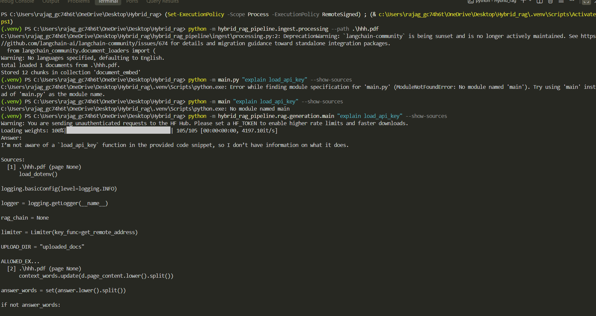
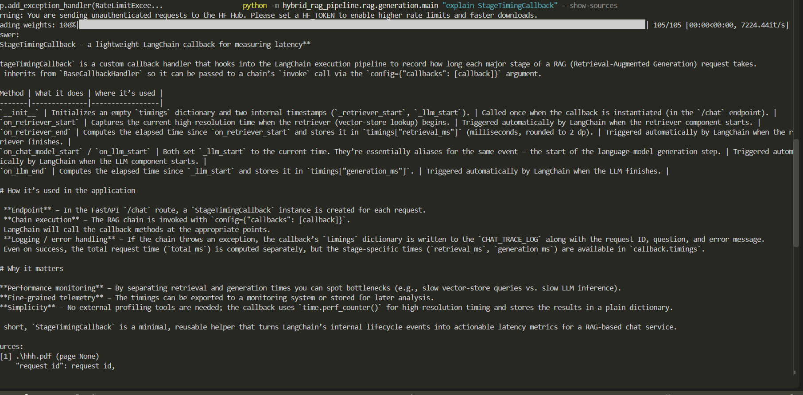
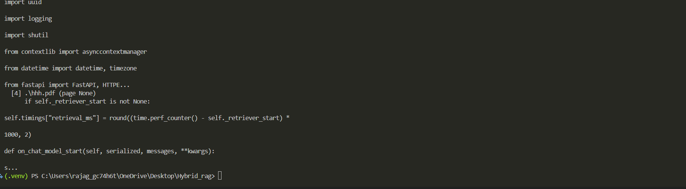
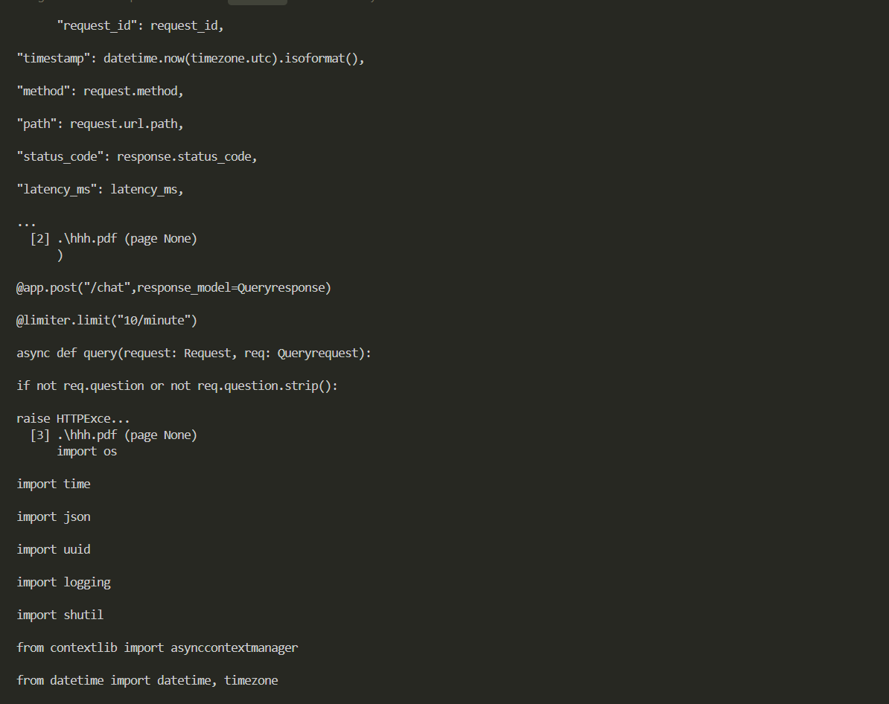
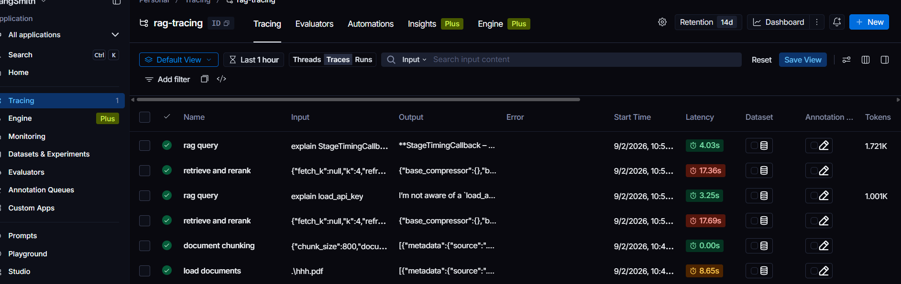
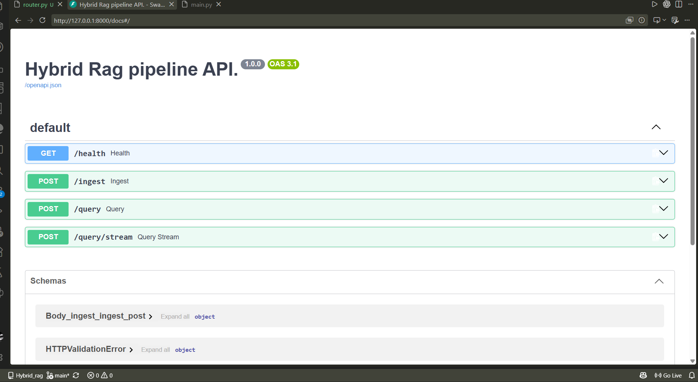
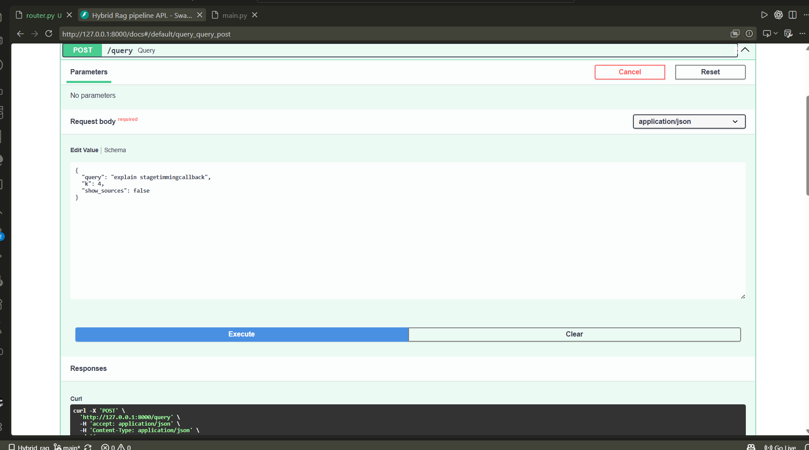
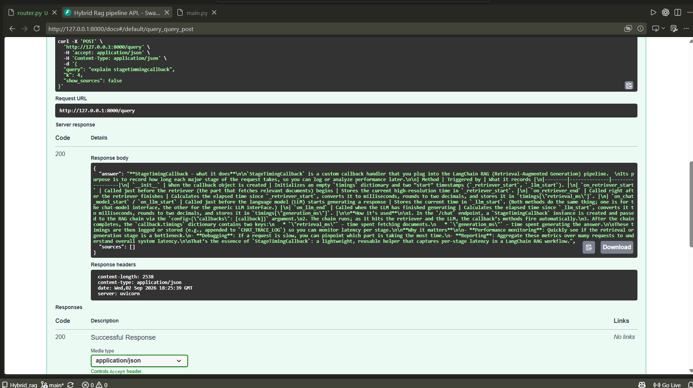
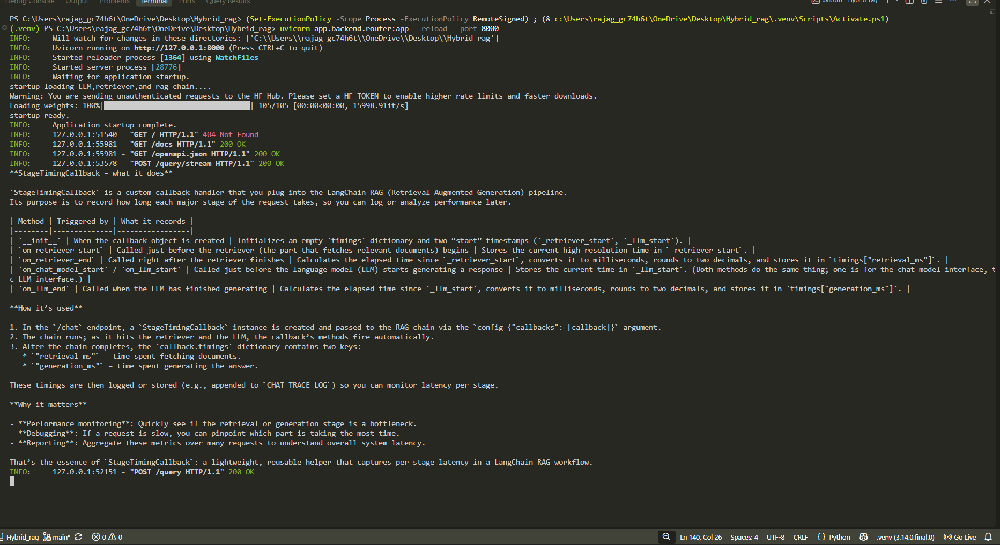

# Hybrid RAG Pipeline

A hybrid Retrieval-Augmented Generation (RAG) system that combines **dense vector search** (Chroma Cloud + Google Gemini embeddings) with **sparse keyword search** (BM25), fused via an ensemble retriever and sharpened with a **cross-encoder reranker**. Answers are generated with a Groq-hosted LLM (`openai/gpt-oss-20b`) and traced end-to-end with LangSmith.

## Architecture

```
                    ┌─────────────────┐
   documents  ─────▶│  processing.py   │  load + chunk documents
 (pdf/docx/img/txt)  └────────┬─────────┘
                              ▼
                    ┌─────────────────┐
                    │  chroma_db.py    │  embed (Gemini) + upsert
                    └────────┬─────────┘
                              ▼
                    ┌──────────────────┐        ┌───────────────┐
                    │ Chroma Cloud      │◀──────▶│  retrieval.py  │
                    │ (vector store)    │        │  BM25 + Vector │
                    └──────────────────┘        │  EnsembleRetr. │
                                                  └───────┬────────┘
                                                          ▼
                                                  ┌───────────────┐
                                                  │  rerank.py     │
                                                  │  Cross-Encoder │
                                                  └───────┬────────┘
                                                          ▼
                                                  ┌───────────────┐
                                                  │  main.py       │
                                                  │  Groq LLM +    │
                                                  │  RAG chain     │
                                                  └───────────────┘
```

## Project Structure

```
hybrid_rag_pipeline/
├── Database/
│   └── chroma_db.py        # Chroma Cloud client + chunk embedding/storage
├── ingest/
│   └── processing.py        # Document loading + chunking (CLI: ingest)
├── rag/
│   └── retriever/
│       ├── retrieval.py     # Vector + BM25 ensemble retrieval (CLI: query/inspect)
│       └── rerank.py        # Cross-encoder reranking wrapper
├── app/
│   └── backend/
│       └── router.py        # FastAPI app: /health, /ingest, /query, /query/stream
└── main.py                  # RAG chain assembly + query CLI
```

> Note: import paths in the source (`hybrid_rag_pipeline.Database.chroma_db`, `hybrid_rag_pipeline.ingest.processing`, `hybrid_rag_pipeline.rag.retriever.retrieval`, `hybrid_rag_pipeline.rag.retriever.rerank`) assume this package layout — adjust `PYTHONPATH` or install the package accordingly if your layout differs.

## Requirements

- Python 3.14
- A [Chroma Cloud](https://www.trychroma.com/) account (API key, tenant, database)
- A Google AI Studio API key (for `gemini-embedding-001`)
- A [Groq](https://groq.com/) API key (for `openai/gpt-oss-20b` inference)
- (Optional) A LangSmith API key for tracing

## Installation

```bash
pip install -r requirements.txt
```

Core dependencies used across the codebase:

```
chromadb
langchain-chroma
langchain-google-genai
langchain-groq
langchain-classic
langchain-community
langchain-text-splitters
langchain-core
langsmith
python-dotenv
unstructured
```

## Environment Variables

Create a `.env` file (one per module directory, or a shared one on `PYTHONPATH`) with:

| Variable | Required | Description |
|---|---|---|
| `CHROMA_API_KEY` | Yes | Chroma Cloud API key |
| `CHROMA_TENANT` | Yes | Chroma Cloud tenant ID |
| `CHROMA_DATABASE` | Yes | Chroma Cloud database name |
| `GOOGLE_API_KEY` | Yes | Google API key for Gemini embeddings |
| `GROQ_API_KEY` | Yes (for querying) | Groq API key for LLM inference |
| `CHROMA_COLLECTION` | No | Collection name (default: `document_embed`) |
| `RERANKER_MODEL` | No | Cross-encoder model (default: `cross-encoder/ms-marco-MiniLM-L-6-v2`) |
| `LANGCHAIN_API_KEY` / `LANGSMITH_API_KEY` | No | Enables LangSmith tracing |
| `LANGCHAIN_TRACING_V2` | No | Defaults to `true` |
| `LANGCHAIN_PROJECT` | No | Defaults to `rag-tracing` |

## Usage

### 1. Ingest documents (`processing.py`)

Loads documents (PDF, DOCX, PNG/JPG, TXT — single file or a directory), splits them into chunks, embeds them with Gemini, and stores them in Chroma Cloud.

```bash
python -m hybrid_rag_pipeline.ingest.processing --path <file_or_folder> [options]
```

**Arguments:**

| Flag | Type | Default | Description |
|---|---|---|---|
| `--path` | str | *required* | File or folder to ingest. Folders are scanned for `*.pdf`, `*.docx`, `*.png`, `*.jpg`, `*.txt`. |
| `--chunk_size` | int | `800` | Max characters per chunk. |
| `--over_lap` | int | `150` | Character overlap between consecutive chunks. |

**Examples:**

```bash
# Ingest a single PDF
python -m hybrid_rag_pipeline.ingest.processing --path ./docs/manual.pdf

# Ingest an entire folder with custom chunking
python -m hybrid_rag_pipeline.ingest.processing --path ./docs --chunk_size 1000 --over_lap 200
```

### 2. Query / inspect the vector store (`retrieval.py`)

Runs hybrid retrieval (Chroma vector search + BM25) with optional cross-encoder reranking, or inspects raw stored documents.

```bash
python -m hybrid_rag_pipeline.rag.retriever.retrieval --query "<question>" [options]
python -m hybrid_rag_pipeline.rag.retriever.retrieval --inspect [options]
```

**Arguments:**

| Flag | Type | Default | Description |
|---|---|---|---|
| `--query` | str | `None` | Query text to retrieve relevant chunks for. Required unless `--inspect` is set. |
| `--k` | int | `4` | Number of final results returned after reranking. |
| `--fetch-k` | int | `4*k` (min `20`) | Number of candidates pulled from vector + BM25 before reranking. |
| `--no-rerank` | flag | `False` | Skip reranking and return raw ensemble retriever results. |
| `--refresh-bm25` | flag | `False` | Force-refresh the in-memory BM25 index from Chroma before querying. |
| `--inspect` | flag | `False` | Print stored documents/metadata instead of running a query. |
| `--limit` | int | `None` | Limit number of documents fetched when using `--inspect`. |
| `--json` | flag | `False` | Output results as JSON instead of pretty-printed text. |

**Examples:**

```bash
# Basic hybrid + reranked query
python -m hybrid_rag_pipeline.rag.retriever.retrieval --query "how does authentication work?"

# Get JSON output, top 6 results, no reranking
python -m hybrid_rag_pipeline.rag.retriever.retrieval --query "auth flow" --k 6 --no-rerank --json

# Inspect the first 20 stored documents
python -m hybrid_rag_pipeline.rag.retriever.retrieval --inspect --limit 20
```

### 3. Ask questions end-to-end (`main.py`)

Runs the full RAG chain: retrieval → reranking → Groq LLM generation, streaming the answer to stdout.

```bash
python -m hybrid_rag_pipeline.main "<your question>" [options]
```

**Arguments:**

| Flag | Type | Default | Description |
|---|---|---|---|
| `query` | str (positional) | *required* | Your question. |
| `--show-sources` | flag | `False` | Print the retrieved source chunks after the answer. |

**Examples:**

```bash
# Ask a question
python -m hybrid_rag_pipeline.main "What does the retrieve function do?"

# Ask and show the retrieved source chunks
python -m hybrid_rag_pipeline.main "Explain the reranking step" --show-sources
```

## Pipeline Details

- **Chunking**: `RecursiveCharacterTextSplitter` with `\n\n`/`\n` separators, configurable size/overlap.
- **Embeddings**: Google `gemini-embedding-001` via `langchain-google-genai`.
- **Vector store**: Chroma Cloud, deduplicated using SHA-256 hashes of chunk content as document IDs.
- **Hybrid retrieval**: `EnsembleRetriever` combining Chroma vector search (weight `0.4`) and `BM25Retriever` (weight `0.6`).
- **Reranking**: `CrossEncoderReranker` (`cross-encoder/ms-marco-MiniLM-L-6-v2` by default) via `ContextualCompressionRetriever`.
- **Generation**: Groq `openai/gpt-oss-20b`, temperature `0.3`, streaming enabled, wrapped in a "don't hallucinate" prompt template.
- **Observability**: All major stages (`load_docs`, `chunk_docs`, `get_vector`, `retrieve`, `ask_streaming`, etc.) are decorated with `@traceable` for LangSmith tracing.

## FastAPI Service Layer

A REST API wrapping ingestion and querying is now available (`app/backend/router.py`), exposing this pipeline over HTTP instead of CLI-only usage:

- `GET /health` — readiness check for the LLM/retriever.
- `POST /ingest` — upload a file (`pdf`/`docx`/`png`/`jpg`/`txt`), chunk it, embed it, and store it in Chroma; refreshes the BM25 cache afterward. Rate-limited to 5/minute via `slowapi`.
- `POST /query` — ask a question against the RAG chain, optionally returning source chunks. Rate-limited to 20/minute.
- `POST /query/stream` — same as `/query` but streams the answer as Server-Sent Events.
- LLM, retriever, and RAG chain are loaded once at startup via a `lifespan` context manager and reused across requests.

**Still to do:** authentication, a persistent job queue for large ingestion batches, a WebSocket alternative to SSE, and more structured error handling for malformed uploads.

Run it locally with:

```bash
pip install fastapi uvicorn slowapi python-multipart
uvicorn app.backend.router:app --reload --port 8000
```

## Notes & Caveats

- `retrieval.py`'s BM25 index is built by pulling **all** stored documents from Chroma into memory (`_get_bm25_docs`), cached process-wide; use `--refresh-bm25` after re-ingesting new documents.
- `GROQ_API_KEY` must be set for `main.py`; it is not required for ingestion or retrieval-only usage.
- Ensure `.env` is not committed — it holds cloud credentials for Chroma, Google, Groq, and LangSmith.

## latency
- **average latency for FFTF:** ` 3.93s`
- **final output is :**  `5.33s`

## Screenshots

CLI in action — ingestion, retrieval, and generation:







FastAPI service in action:




